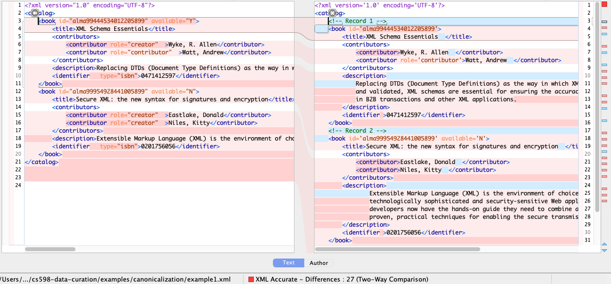
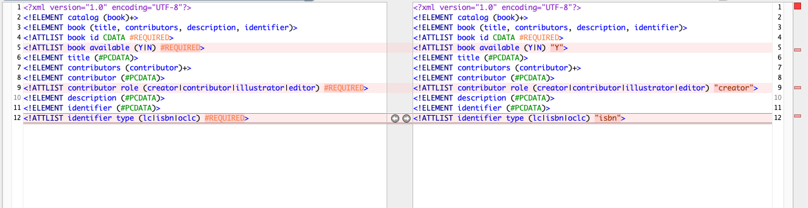
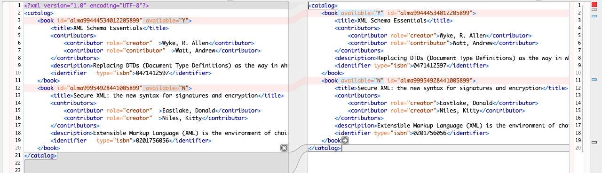
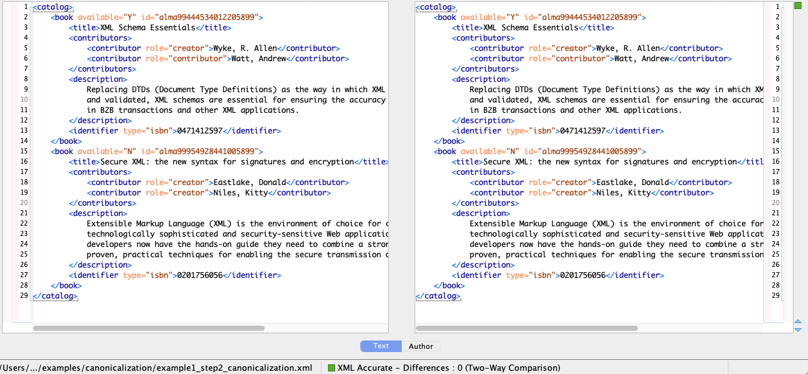

# Canonicalization

This example is provided for CS598 Foundations of Data Curation 
Assignment 3 on canonicalization. It is intended to provide a basic
example of canonicalization and does not cover all of the requirements
of the assignment.

## Scenario

A library is testing two different catalog systems that are supposed 
provide the same information. Given example records and DTDs from both 
systems, our job is to determine whether they truly represent
the same information.

Without inspecting the files, an MD5 digest indicates differences:
```
MD5 (example1.xml) = bcebd02b25df7a3463cd21649138bc45
MD5 (example2.xml) = f983dd3f1ec368788794895a35eb3c46
```

Comparing the two XML files, we can see several differences:

* `example2.xml` lacks the `available` and `role` attributes in some cases
* `example2.xml` has comments, `example1.xml` does not
* There are clear whitespace differences between the files
* Use of single quotes versus double quotes



Comparing the two DTDs, we can also see differences:

* `example2.dtd` has default values for some attributes where `example1.dtd` has required, 
  non-default attributes.



Are these differences significant or just a difference in how the information is represented? 
Canonicalization, converting both sets of files to a canonical or standard form,
is one approach to address this question. Because the files are XML, we can use
[XML Canonicalization](https://www.w3.org/TR/xml-c14n/) but recognize that there may
be application-specific differences that need to be addressed separately.

## Validating the Files

Prior to canonicalization, validation will ensure that the provided files
conform to the associated DTDs and that the files were not corrupted during
transfer.

```
xmllint --noout --dtdvalid example1.dtd example1.xml
xmllint --noout --dtdvalid example2.dtd example2.xml
```

In this case, both files validate against their corresponding schemas.

## XML Canonicalization

Basic XML canonicalization can be implemented manually or using standard tools
such as Oxygen XML and `xmllint`. We expect that the tools will handle some if
not all of the steps defined in the
[specification](https://www.w3.org/TR/xml-c14n/). The following are a subset,
see the specification for the complete list:

* Attribute values are normalized, as if by a validating processor
* Character and parsed entity references are replaced
* The XML declaration and document type declaration are removed
* Empty elements are converted to start-end tag pairs
* Whitespace outside of the document element and within start and end tags is normalized
* All whitespace in character content is retained (excluding characters removed during line feed normalization)
* Attribute value delimiters are set to quotation marks (double quotes)
* Special characters in attribute values and character content are replaced by character references
* Default attributes are added to each element


In this example, we'll use `xmllint` to perform basic XML Canonicalization:
```
xmllint -c14n11 example1.xml  > example1_step1_c14n.xml
xmllint -c14n11 example2.xml  > example2_step1_c14n.xml
```

Comparing the canonicalized and original files, we can see a few differences:

* Attributes are in alphabetical order
* The XML declaration and document type declaration are removed
* Whitespace within the start and end tags is removed




## Beyond Basic XML Canonicalization

Several differences were not addressed by the tool:

* Comments were not removed
* Default attributes were not added to the elements
* Whitespace differences remain in character content

(Note that different tools offer different options. For example, some will have an option 
to remove comments during canonicalization.)

After manually or programmatically addressing these differences, we can see that the
two files can be made to be identical. 



This can be confirmed via comparison of MD5 hashes:

```
MD5 (example1_step2_canonicalization.xml) = c3ef7e2b26b83f645c4c0bb41e090698
MD5 (example2_step2_canonicalization.xml) = c3ef7e2b26b83f645c4c0bb41e090698
```

### Are the Differences Meaningful?

Through canonicalization, we've show that the XML files can be made to be identical. 
After addressing differences in their schemas and how the content was structured in each file, 
the most significant differences were the comments and the whitespace in the character content.
In this example, we consider these differences to be non-meaningful. 
